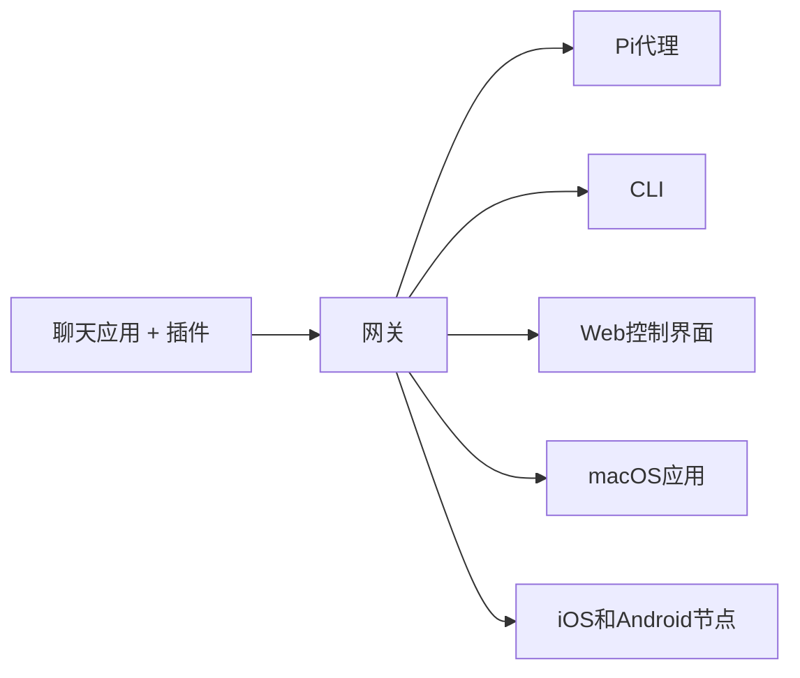

# OpenClaw：自托管的AI助手网关平台

> *"EXFOLIATE! EXFOLIATE!"* — 一只太空龙虾，可能说过

<p align="center">
  <strong>跨WhatsApp、Telegram、Discord、iMessage等平台的AI代理操作系统网关。</strong><br />
  发送消息，从口袋中获得AI代理响应。插件支持Mattermost等更多平台。
</p>

## 什么是OpenClaw？

OpenClaw是一个**自托管网关**，可以将您喜欢的聊天应用——WhatsApp、Telegram、Discord、iMessage等——连接到AI编码助手（如Pi）。您在自己的机器（或服务器）上运行一个单一的Gateway进程，它就成为您的消息应用与始终可用的AI助手之间的桥梁。

**适合谁使用？** 开发者和高级用户，他们希望拥有一个可以从任何地方发送消息的个人AI助手，而无需放弃数据控制权或依赖托管服务。

**有什么不同之处？**

* **自托管**：在您自己的硬件上运行，遵循您的规则
* **多通道**：一个网关同时服务WhatsApp、Telegram、Discord等
* **代理原生**：专为具有工具使用、会话、内存和多代理路由功能的编码代理而构建
* **开源**：MIT许可，社区驱动

**需要什么？** Node 24（推荐），或Node 22 LTS（`22.16+`）以保持兼容性，来自您选择的提供商的API密钥，以及5分钟时间。为了获得最佳质量和安全性，请使用可用的最强最新一代模型。

## 工作原理



网关是会话、路由和通道连接的单一事实来源。

## 核心功能

### 多通道网关
WhatsApp、Telegram、Discord和iMessage通过单一的Gateway进程连接。

### 插件通道
通过扩展包添加Mattermost等更多平台。

### 多代理路由
每个代理、工作空间或发送者的独立会话。

### 媒体支持
发送和接收图像、音频和文档。

### Web控制界面
用于聊天、配置、会话和节点的浏览器仪表板。

### 移动节点
配对iOS和Android节点，支持Canvas、摄像头和语音启用工作流程。

## 快速开始

### 1. 安装OpenClaw
```bash
npm install -g openclaw@latest
```

### 2. 初始化并安装服务
```bash
openclaw onboard --install-daemon
```

### 3. 配对WhatsApp并启动网关
```bash
openclaw channel
```

## 架构优势

### 数据主权
所有数据都保留在您自己的基础设施上，没有第三方可以访问您的对话或文件。

### 可扩展性
模块化架构允许轻松添加新的聊天平台、AI模型和功能。

### 社区驱动
活跃的开源社区不断贡献新的插件、主题和功能改进。

## 使用场景

### 个人AI助手
- 通过WhatsApp或Telegram查询信息
- 代码片段生成和调试
- 日程安排和提醒设置

### 团队协作
-Mattermost集成团队AI助手
- 项目文档查询
- 自动化任务处理

### 开发者工具
- 通过聊天界面执行Git操作
- 服务器状态监控
- 部署和CI/CD触发

## 技术栈

- **后端**：Node.js
- **前端**：React/Next.js（控制界面）
- **数据库**：SQLite（默认），支持PostgreSQL
- **消息队列**：Redis（可选）
- **容器化**：Docker支持

## 社区与生态系统

OpenClaw拥有一个活跃的开发者社区，提供：

- **技能市场**：从ClawHub.com发现和安装代理技能
- **插件库**：各种聊天平台和服务的插件
- **主题系统**：可自定义的界面主题
- **API文档**：完整的REST API和WebSocket接口

## 安全特性

- 端到端加密（支持平台）
- 基于角色的访问控制
- 审计日志
- 定期安全更新

## 未来路线图

OpenClaw团队正在开发以下功能：

1. **语音识别集成**：支持语音命令和响应
2. **多模态AI**：图像和视频内容分析
3. **企业功能**：SAML/SSO集成，合规性工具
4. **边缘计算**：在边缘设备上运行轻量级模型

## 结语

OpenClaw代表了AI助手领域的一个重要趋势：将控制权交还给用户。通过自托管的解决方案，您可以享受AI助手的便利，同时保持对数据的完全控制。

无论您是希望拥有一个个人AI助手，还是需要为团队部署企业级解决方案，OpenClaw都提供了一个强大、灵活且安全的平台。

---

**了解更多**：
- [官方文档](https://docs.openclaw.ai)
- [GitHub仓库](https://github.com/openclaw/openclaw)
- [社区Discord](https://discord.com/invite/clawd)

> *本文内容基于OpenClaw官方文档，旨在展示知识星球的内容展示能力。*
